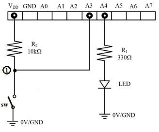
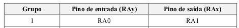

# Lab 1 – I/O Ports & LCD Display

📚 Course: Embedded Systems Electronics (ESE-2526)
🔧 Platform: PIC16F1718 + MPLAB X + MCC + PICkit 3

---

## Overview

This lab introduces:

* Configuring microcontroller I/O ports (input + output).
* Driving an external LCD display via parallel communication.
* Using MPLAB X IDE, MCC, and debugging with simulator + hardware.

---

## Circuit




---

## Simulation Analysis

### Registers at Init

```c
// LATx
LATA = 0x00; LATB = 0x00; LATC = 0x00;
// TRISx
TRISA = 0xFD; TRISB = 0xC0; TRISC = 0xFF; TRISE = 0x08;
// ANSELx
ANSELA = 0x3A; ANSELB = 0x00; ANSELC = 0xFC;
```

### Macros

* **Switch\_GetValue()** → reads RA0 (ON/OFF)
* **LED\_SetHigh()** → sets RA1 = 1 (LED ON)
* **LED\_SetLow()** → sets RA1 = 0 (LED OFF)

### SFR Addresses

* `TRISA`: 0x08C
* `PORTA`: 0x00C
* `LATA`: 0x10C

---

## Debug Results

* Breakpoints: `LED_SetHigh` / `LED_SetLow`
* With switch **High**, LED is **OFF**

| Register | Addr  | Value | Notes                |
| -------- | ----- | ----- | -------------------- |
| PORTA    | 0x0C  | 0x01  | RA0=1 (switch High)  |
| TRISA    | 0x8C  | 0xFD  | unchanged            |
| LATA     | 0x10C | 0x00  | latch, not pin state |

💡 **Reminder:** LATA shows last written latch, not real pin state.

---

## ANSELA

`00111000` → RA0/RA1 digital, rest analog.

## OSCCON

`01101000` → IRCF = `1101` → 4 MHz internal oscillator.

---

## Expected Behavior

* Switch Low → LED ON.
* Switch High → LED OFF.
* LCD displays group number `n` at position `n+3`.

---

## LCD Display

### Goal

Write the group number `n` at position `n+3` of the LCD.
For our group (**n=1**), this means writing `'1'` at position **4**.

---

### Procedure

1. Initialize LCD with provided library (`LCD.c` / `LCD.h`).
2. Send instruction to set DDRAM address = 0x83 (position 4).

   * Done in 4-bit mode, so sent as two nibbles:

     * First nibble = `1000`
     * Second nibble = `0011`
3. Send ASCII code of `'1'` = 0x31.

   * Sent as two nibbles:

     * First nibble = `0011`
     * Second nibble = `0001`

---

### Code Snippet

```c
// Set DDRAM Address to 0x83 (position 4)
RS = 0;  // instruction
D7=1; D6=0; D5=0; D4=0; EN=1; __delay_us(20); EN=0; // 1000
D7=0; D6=0; D5=1; D4=1; EN=1; __delay_us(20); EN=0; // 0011

// Write ASCII '1' (0x31)
RS = 1;  // data
D7=0; D6=0; D5=1; D4=1; EN=1; __delay_us(20); EN=0; // 0011
D7=0; D6=0; D5=0; D4=1; EN=1; __delay_us(20); EN=0; // 0001
```

---

### Verification in MPLAB Simulator

* Use **Logic Analyzer** to watch pins `RS`, `EN`, and `D7–D4`.
* Sequence observed:

  * `1000 → 0011` (instruction 0x83)
  * `0011 → 0001` (data 0x31 = `'1'`).
* Confirms correct address + character written.

---

## Final Results

* LED controlled by external switch.
* LCD shows group number `'1'` at position **4**.
* Verified in simulator via pin toggling + waveform analysis.
